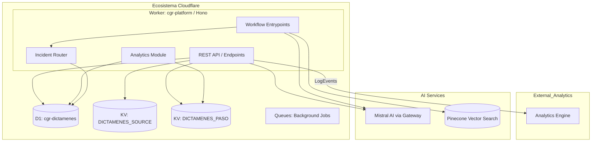
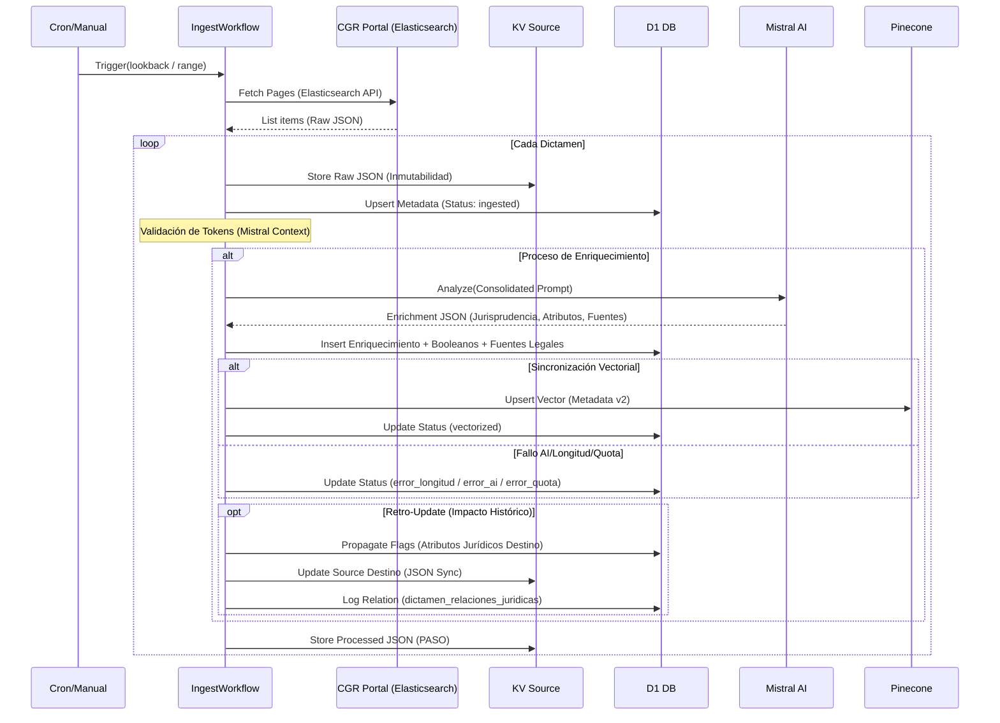

# 01 - Arquitectura C4 y Flujos de Datos (Profundidad Técnica)

Este documento detalla la estructura técnica de **CGR-Platform**. Se basa en el modelo C4 para proporcionar visibilidad desde el contexto sistémico hasta el detalle de los componentes y workflows.

---

## 🏗️ Nivel 2: Diagrama de Contenedores (Ecosistema)

Detalle de cómo interactúan los servicios vinculados al Worker principal en Cloudflare.

---

## 🔄 Nivel 3: Flujos Críticos (Workflows)

### 3.1 Ciclo de Vida de Ingesta (IngestWorkflow)
El corazón de la plataforma reside en sus procesos de larga duración gestionados por Cloudflare Workflows. Este flujo asegura la resiliencia y la inmutabilidad del dato original.

---

## 🛠️ Nivel 4: Detalles de Implementación (Source of Truth)

### 4.1 Ingeniería Inversa: Scraping de CGR
El sistema no utiliza un scraper de DOM tradicional; interactúa directamente con la API de Elasticsearch del portal de la Contraloría:
- **Endpoint**: `https://www.contraloria.cl/apibusca/search/dictamenes`
- **Método**: `POST` con cuerpo JSON.
- **Filtros**: Permite segmentar por `fecha_documento`, `n_dictamen` y `year_doc_id` usando sintaxis **Lucene**.

### 4.2 Inferencia Consolidada (Mistral)
Para optimizar costos y latencia, el sistema utiliza un **Prompt Consolidado**. En lugar de múltiples llamadas, se envía el texto completo para extraer simultáneamente:
1.  **Título y Resumen Jurídico**.
2.  **Análisis de Jurisprudencia** (si genera o no jurisprudencia).
3.  **Atributos Booleanos** (ej: si afecta a funcionarios, si es de carácter general).
4.  **Fuentes Legales** (Leyes, Decretos, etc.).
5.  **Acciones Jurídicas Emitidas (Retro-Update)**: Identificación de dictámenes antiguos que son modificados por el nuevo documento.

### 4.3 Pinecone Integrated Inference
Se utiliza el modelo **Serverless** de Pinecone con inferencia integrada:
- El Worker no genera los embeddings localmente.
- Se envía el texto a Pinecone y sus servidores internos gestionan el modelo de embeddings definido en el índice (`mistralLarge2512`).

---

> [!IMPORTANT]
> **Resiliencia**: Todo llamado externo (`fetch`) está protegido por el `IncidentRouter`. Si una API falla, se genera un registro en D1 y se activa el protocolo de recuperación (Skill) correspondiente.

**Referencia de Código**: [src/index.ts](file:///home/bilbao3561/github/cgr/cgr-platform/src/index.ts), [src/workflows/ingestWorkflow.ts](file:///home/bilbao3561/github/cgr/cgr-platform/src/workflows/ingestWorkflow.ts).
