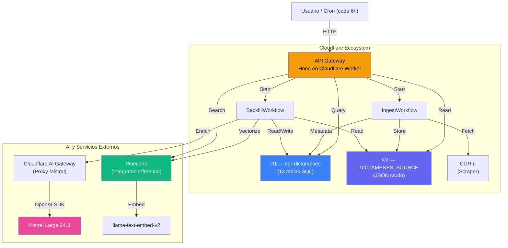
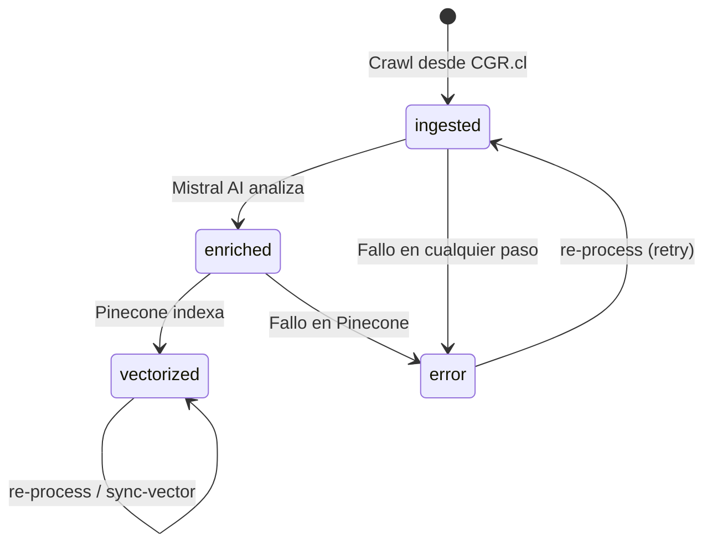
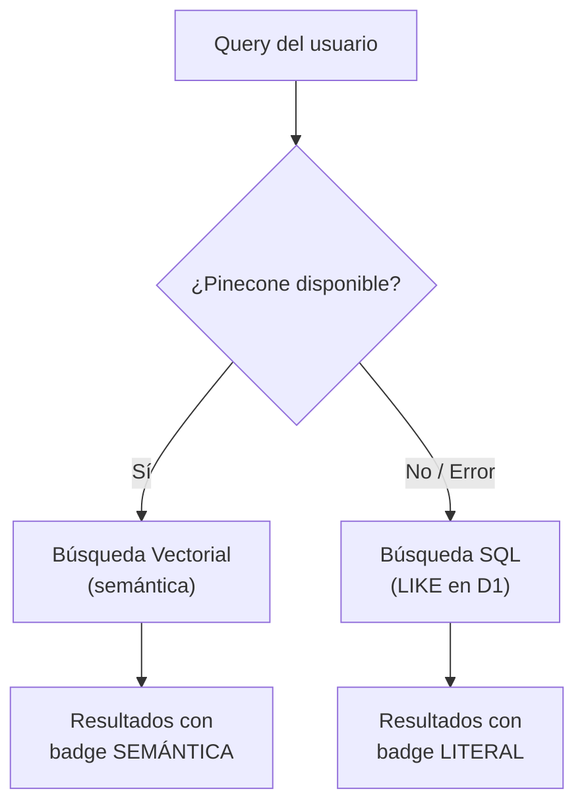

# 2. Arquitectura y Diseño Tecnológico

## 2.1 Diagrama General



---

## 2.2 Componentes Principales

### API Gateway (Hono)
Archivo: `cgr-platform/src/index.ts`

Un enrutador HTTP ultraliviano que expone endpoints REST. Es el punto de entrada único del sistema. Maneja:
- Búsqueda con fallback automático (vectorial → SQL)
- Detalle de dictámenes consolidando D1 + KV + enrichment
- Endpoints administrativos para crawl, batch-enrich, re-process y sync-vector
- Handler `scheduled` para el Cron Job

### Workflows (Cloudflare Workflows)
A diferencia de colas tradicionales, los Workflows son **orquestadores con estado persistente**:

| Workflow | Archivo | Binding | Función |
|---|---|---|---|
| **IngestWorkflow** | `src/workflows/ingestWorkflow.ts` | `WORKFLOW` | Crawl de CGR.cl → KV + D1 (`ingested`) |
| **BackfillWorkflow** | `src/workflows/backfillWorkflow.ts` | `BACKFILL_WORKFLOW` | Mistral + Pinecone → D1 (`vectorized`) |

Cada paso dentro de un workflow:
- Es **idempotente** y re-ejecutable
- Tiene **reintentos automáticos** con backoff exponencial
- Es **observable** en el Dashboard de Cloudflare (estado, duración, salida)
- Tiene un **timeout de 10 minutos** por paso

### Capa de Datos (Híbrida)

#### Cloudflare D1 — `cgr-dictamenes`
Base de datos SQLite en el edge. Almacena metadatos estructurados, resultados del enriquecimiento IA, y relaciones M:N (etiquetas, fuentes legales, booleanos).

#### Cloudflare KV — `DICTAMENES_SOURCE`
Almacén key-value global. Guarda el JSON crudo completo descargado de CGR.cl. La llave es `dictamen:{ID}` y el valor es el objeto JSON original sin modificar.

**¿Por qué ambos?** D1 es eficiente para queries SQL pero costoso para blobs gigantes de texto. KV es barato para almacenar objetos grandes pero no permite queries. La combinación da lo mejor de ambos mundos.

### Motor de IA — Mistral via AI Gateway

| Configuración | Valor |
|---|---|
| Modelo | `mistral-large-2411` |
| Endpoint | Cloudflare AI Gateway (proxy) |
| URL | `gateway.ai.cloudflare.com/v1/.../cgr-gateway/mistral/v1` |
| SDK | OpenAI (compatibilidad) |
| Autenticación | `MISTRAL_API_KEY` + `CF_AIG_AUTHORIZATION` |

El AI Gateway de Cloudflare actúa como proxy entre el Worker y Mistral, proporcionando:
- **Logging centralizado** de todas las peticiones
- **Caché** de respuestas idénticas
- **Rate limiting** controlado
- **Observabilidad** en el Dashboard

> [!IMPORTANT]
> El header `cf-aig-authorization` es **obligatorio** para autenticarse ante el AI Gateway. Se configura como secret `CF_AIG_AUTHORIZATION` en Cloudflare Workers. Sin este secret, todas las llamadas a Mistral fallarán con `401 Unauthorized`.

### Motor Vectorial — Pinecone (Integrated Inference)

| Configuración | Valor |
|---|---|
| Index Host | `cgr-8aea039.svc.aped-4627-b74a.pinecone.io` |
| Namespace | `mistralLarge2411` |
| Modelo embedding | `llama-text-embed-v2` (1024 dimensiones) |
| API | REST directa (`fetch`) — NO SDK |

**Decisión de diseño crítica:** No usamos el SDK npm de Pinecone (`@pinecone-database/pinecone`). En su lugar, usamos llamadas `fetch` crudas a los endpoints REST `/records/namespaces/{ns}/upsert` y `/records/namespaces/{ns}/search`. La razón: el SDK fuerza envío de vectores pre-generados, pero nosotros usamos **Integrated Inference** donde Pinecone recibe texto plano y genera los embeddings internamente con `llama-text-embed-v2`.

**Formato del payload de upsert:**
```json
{
  "_id": "E129499N25",
  "analisis": "Título: ... Resumen: ... Análisis: ...",
  "titulo": "Procedencia de pagos...",
  "fecha": "2025-01-15"
}
```

> [!CAUTION]
> El payload es un **objeto individual**, NO un array. Enviar `[{...}]` causa `400 INVALID_ARGUMENT: expected 'object', but found 'array'`.

---

## 2.3 Esquema de Base de Datos (D1)

La base `cgr-dictamenes` (ID: `c391c767-2c72-450c-8758-bee9e20c8a35`) contiene las siguientes tablas:

### Tablas Principales

#### `dictamenes` — Tabla central (84.973 registros)
| Columna | Tipo | Descripción |
|---|---|---|
| `id` | TEXT PK | Identificador único (ej: `E129499N25`, `D56N26`) |
| `numero` | TEXT | Número oficial del dictamen |
| `anio` | INTEGER | Año del dictamen |
| `fecha_documento` | TEXT | Fecha de emisión |
| `materia` | TEXT | Materia jurídica |
| `criterio` | TEXT | Criterio jurisprudencial |
| `destinatarios` | TEXT | Destinatarios del dictamen |
| `estado` | TEXT | `ingested` → `enriched` → `vectorized` \| `error` |
| `crawled_from_cgr` | INTEGER | 1 si fue crawleado por el Worker |
| `origen_importacion` | TEXT | Origen: `worker_cron_crawl`, `mongoDb`, etc. |
| `updated_at` | TEXT | Timestamp ISO de última modificación |
| `created_at` | TEXT | Timestamp ISO de creación |

#### `enriquecimiento` — Análisis IA (relación 1:1 con dictamenes, PK = dictamen_id)
| Columna | Tipo | Descripción |
|---|---|---|
| `dictamen_id` | TEXT PK/FK | Referencia a `dictamenes.id` |
| `titulo` | TEXT | Título generado por Mistral |
| `resumen` | TEXT | Resumen ejecutivo |
| `analisis` | TEXT | Análisis jurídico completo |
| `etiquetas_json` | TEXT | Array de etiquetas como JSON |
| `genera_jurisprudencia` | INTEGER | 0/1 según criterio de Mistral |
| `booleanos_json` | TEXT | 12 campos booleanos como JSON |
| `fuentes_legales_json` | TEXT | Fuentes legales citadas como JSON |
| `modelo_llm` | TEXT | Modelo usado (ej: `mistral-large-2411`) |
| `fecha_enriquecimiento` | TEXT | Timestamp del enriquecimiento |

> **Nota:** La clave KV se computa directamente como `dictamen:{ID}`, sin necesidad de tabla de punteros.

### Tablas de Relación

| Tabla | Contenido |
|---|---|
| `atributos_juridicos` | 12 booleanos jurídicos por dictamen (1:1) |
| `dictamen_etiquetas_llm` | Etiquetas extraídas por IA |
| `dictamen_fuentes_legales` | Fuentes legales citadas |
| `dictamen_referencias` | Referencias cruzadas entre dictámenes |
| `historial_cambios` | Auditoría de modificaciones |
| `cat_estado_pipeline` | Catálogo de estados (ingested, enriched, vectorized, error) |
| `registro_ejecucion` | Log de ejecuciones de workflows |
| `auditoria_migracion` | Trazabilidad de la migración desde MongoDB |

---

## 2.4 Máquina de Estados

Cada dictamen transita por estados bien definidos:



| Estado | Significado |
|---|---|
| `ingested` | JSON crudo descargado. Sin análisis IA, sin vector. |
| `enriched` | Mistral lo analizó, pero Pinecone aún no lo indexó. |
| `vectorized` | Completo. Disponible para búsqueda semántica. |
| `error` | Falló en algún paso. Requiere re-process. |

---

## 2.5 Patrón de Búsqueda Resiliente (Fallback)



Si Pinecone falla (timeout, error 5xx, cuota excedida):
1. El `catch` en `index.ts` atrapa la excepción
2. Reescribe la petición como `SELECT ... WHERE materia LIKE %query% OR n_dictamen LIKE %query%`
3. El frontend detecta `origen_busqueda: 'literal'` y muestra badge gris "Búsqueda Literal"
4. **El usuario nunca ve un error** — solo resultados menos precisos

---

## 2.6 Flujo de Datos Detallado

### Pipeline de Ingesta (IngestWorkflow)

```
1. Cron trigger (cada 6h) o POST /crawl/range
   ↓
2. Calcula ventana de fechas (hoy - CRAWL_DAYS_LOOKBACK días)
   ↓
3. Pagina automáticamente la API de CGR (máximo 50 páginas × ~20 items)
   ↓
4. Para cada dictamen:
   a. Verifica si ya existe en D1 (skip si no es error)
   b. Guarda JSON crudo en KV → clave "dictamen:{ID}"
   c. Crea registro en D1 → estado "ingested"
```

### Pipeline de Enriquecimiento (BackfillWorkflow)

```
1. POST /batch-enrich con {batchSize: 50, delayMs: 1000}
   ↓
2. Consulta D1 → SELECT id FROM dictamenes WHERE estado = 'ingested' LIMIT batchSize
   ↓
3. Para cada dictamen:
   a. Lee JSON crudo desde KV
   b. Pausa delayMs para evitar rate limit
   c. Envía a Mistral (prompt jurídico experto) → recibe JSON estructurado
   d. Guarda enrichment en D1 (título, resumen, análisis, etiquetas, booleanos, fuentes)
   e. Actualiza estado a "enriched"
   f. Construye texto: "Título: X Resumen: Y Análisis: Z"
   g. Upsert a Pinecone (Integrated Inference vectoriza internamente)
   h. Actualiza estado a "vectorized"
   ↓
4. Retorna resumen: {total: 50, ok: 48, error: 2, mensaje: "..."}
```
