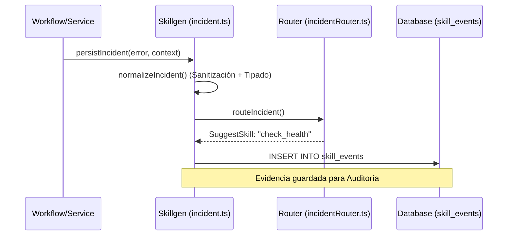

# 10 - Guía de Integración con Skillgen

Este documento instruye a desarrolladores (humanos e IA) sobre cómo integrar nuevos módulos, servicios o workflows con **Skillgen**, el motor de gobernanza determinista de incidentes de la CGR-Platform.

---

## 🚀 1. Filosofía de Integración
Skillgen no es solo un sistema de logs; es una **"Caja Negra" inteligente**. Su misión es:
1.  **Capturar**: Detectar fallos en tiempo real.
2.  **Estructurar**: Convertir errores crudos en `Incidents` tipados.
3.  **Sanitizar**: Eliminar secretos automáticamente (PII y API Keys).
4.  **Rutar**: Decidir qué "Habilidad" (`Skill`) puede diagnosticar o reparar el fallo.
5.  **Persistir**: Guardar evidencia forense en `skill_events` (D1).

---

## 🛠 2. Cómo integrar un nuevo desarrollo

### Paso A: Definir el "Contrato de Error"
Antes de escribir código, identifica qué fallos específicos puede tener tu componente. Añade los nuevos códigos en `src/lib/incident.ts`:

```typescript
// src/lib/incident.ts
export type IncidentCode = 
  // ... existentes
  | 'MI_NUEVO_SERVICIO_ERROR'
  | 'API_EXTERNA_AUTHERROR';
```

### Paso B: Invocar a Skillgen (El patrón persistIncident)
Cualquier bloque `try/catch` en un Workflow o Servicio debe delegar el error a Skillgen. Usa la función `persistIncident` de `src/storage/incident_d1.ts`:

```typescript
import { persistIncident } from '../storage/incident_d1';

try {
  // Tu lógica de negocio aquí
} catch (error) {
  await persistIncident(
    env,              // Bindings de Cloudflare
    error,            // El error capturado
    'mi-servicio',    // Nombre del servicio
    'mi-workflow',    // Nombre del workflow
    event.instanceId, // ID único de ejecución
    { extra: 'data' } // Contexto adicional útil para el diagnóstico
  );
  throw error; // Re-lanza para que el Workflow maneje el reintento
}
```

### Paso C: Configurar el Ruteo
Define qué Skill debe activarse cuando ocurra tu error en `src/lib/incidentRouter.ts`:

```typescript
// src/lib/incidentRouter.ts
const RULES: Record<IncidentCode, { skill: string; reason: string }> = {
  MI_NUEVO_SERVICIO_ERROR: {
    skill: 'mi_nueva_skill_diagnostico',
    reason: 'Fallo crítico en el servicio X'
  },
  // ...
};
```

---

## 🧬 3. Anatomía de la Normalización
Skillgen usa `normalizeIncident` para limpiar la data. Si tu error tiene un mensaje predecible, añade una regla de detección por Regex en `src/lib/incident.ts`:

```typescript
// Ejemplo de detección automática
if (/error de timeout en sap/i.test(normalizedMessage)) {
  return withFingerprint({
    ...baseIncident,
    kind: 'io',
    system: 'http',
    code: 'SAP_TIMEOUT',
    context: sanitizedContext
  });
}
```

---

## 📊 4. Flujo de Datos (Secuencia)



---

## 🔍 5. Verificación
Toda nueva integración **DEBE** venir acompañada de un script de prueba en `src/scripts/` para validar que el incidente se normaliza y rutea correctamente sin necesidad de desplegar a producción.

> [!IMPORTANT]
> Consulta la [00 - Guía de Estándares para Agentes LLM](00_guia_estandares_agentes_llm.md) para asegurar que el registro de incidentes incluya toda la metadata necesaria para "El Librero".

---
[Referencia: 03 - Referencia Exhaustiva de API](03_referencia_api.md)
