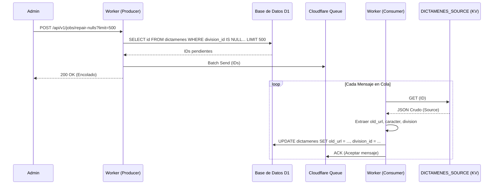

# 12 - Mecanismo de Reparación de Nulos (Queue Task)

Este documento describe el sistema de reparación asíncrona diseñado para corregir registros en la tabla `dictamenes` que presentan valores nulos en columnas críticas como `division_id` y `old_url`, recuperándolos desde la fuente de verdad en `KV`.

---

## 🏗️ 1. Arquitectura del Sistema

El proceso utiliza una arquitectura **Productor-Consumidor** basada en **Cloudflare Queues** (`cgr-repair-queue`) para garantizar:
- **Resiliencia**: Los fallos en un registro no detienen el proceso global; el mensaje se reintenta automáticamente.
- **Bajo Impacto**: Evita bloqueos de escritura masiva en D1 al procesar de forma secuencial y controlada.
- **Escalabilidad**: Permite procesar miles de registros en segundo plano.



---

## 🚀 2. Uso y Disparadores

### 2.1 Disparo Manual (Recomendado)
Para iniciar un lote de reparación, se debe invocar el endpoint productor. Es seguro llamarlo múltiples veces; el sistema ignora registros ya reparados.

- **Endpoint**: `/api/v1/jobs/repair-nulls`
- **Método**: `POST`
- **Query Params**:
  - `limit`: Cantidad de registros a buscar y encolar (ej: `500`).
  - `id`: Para reparar un dictamen específico fuera de lote.

#### Ejemplo de Comando CURL
```bash
curl -X POST "https://cgr-platform.abogado.workers.dev/api/v1/jobs/repair-nulls?limit=1000" \
  -H "x-admin-token: <TOKEN>"
```

---

## 🛠️ 3. Lógica de Negocio (El Consumidor)

El consumidor (`queue()` en `index.ts`) realiza los siguientes pasos por cada ID recibido:

1. **Lectura KV**: Busca la clave exacta en `DICTAMENES_SOURCE`.
2. **Fallback de Clave**: Si no lo encuentra por el ID puro, intenta con el prefijo `dictamen:<ID>`.
3. **Extracción de Datos**:
   - `old_url`: Extraído de `_source.old_url`.
   - `division_id`: Obtenido mediante `getOrInsertDivisionId(db, source.origenes)`.
   - `caracter`: Extraído de `_source.carácter` o `_source.caracter`.
4. **Persistencia Atómica**:
   - Actualiza `old_url` y `division_id` solo si son nulos (`COALESCE`).
   - Actualiza el campo `caracter` en la tabla `atributos_juridicos`.
5. **Manejo de Errores**:
   - Si no hay JSON en KV: Marca el dictamen como `sin_kv` y cambia el origen a `missing_kv`.
   - Si no se encuentra URL ni División: Cambia el origen a `repaired_incomplete`.

---

## 📊 4. Monitoreo

Puedes verificar el progreso de la reparación consultando el conteo de nulos:

```sql
SELECT count(*) FROM dictamenes WHERE division_id IS NULL OR old_url IS NULL;
```

---

[Referencia: 00 - Guía de Estándares para Agentes LLM](file:///home/bilbao3561/github/cgr/docs/v2/platform/00_guia_estandares_agentes_llm.md)
