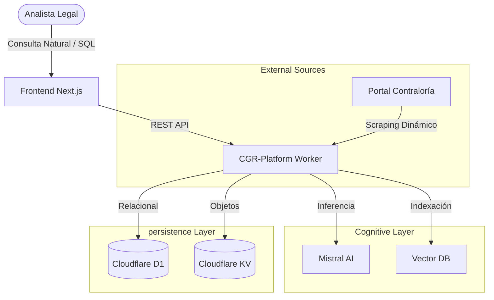

# 01 - Visión Ejecutiva: CGR-Platform (Nivel Experto)

## Propósito y Valor Estratégico
**CGR-Platform** no es solo un recolector de datos; es una **Plataforma de Gobernanza Documental Inteligente**. Su core reside en la capacidad de transformar el "ruido legal" de miles de dictámenes en una estructura de grafos y vectores que permite la toma de decisiones basada en jurisprudencia histórica con una precisión sin precedentes.

### Pilares Tecnológicos
1. **Orquestación Resiliente (Cloudflare Workflows)**: A diferencia de los scripts de cron tradicionales, el uso de Workflows permite gestionar ejecuciones que duran días, con persistencia automática de estado y manejo de reintentos a nivel de paso (step).
2. **Gobernanza Determinista (Skills System)**: Implementación de una arquitectura de "Self-Healing". Ante fallos externos (CGR offline, Mistral Timeout, D1 Schema Drift), el sistema activa protocolos de diagnóstico automatizados que registran y enrutan incidentes sin intervención manual.
3. **Inferencia Semántica Multicanal**: Integración con Mistral AI para el enriquecimiento y Pinecone para la búsqueda. El sistema no solo guarda texto; guarda *significado* y *relaciones legales* (Booleanos Jurídicos, Fuentes Legales, Descriptores).
4. **Almacenamiento Híbrido Cold/Hot**:
   - **KV (Cold/Blob)**: Para la inmutabilidad de la fuente original.
   - **D1 (Hot/Indexed)**: Para la operatividad diaria y reportabilidad SQL.

---

## Arquitectura C4: Visión de Contexto
El sistema se integra en el borde (Edge) de Cloudflare, minimizando la latencia y maximizando la seguridad.

---

## ROI y Eficiencia Operacional
- **Deduplicación Inteligente**: El sistema reconoce dictámenes ya procesados incluso si cambian ligeramente en el portal original, ahorrando costos de almacenamiento e inferencia.
- **Auditoría de IA**: Registro detallado de cada llamada a LLM, permitiendo optimizar prompts y reducir el consumo de tokens.
- **Estandarización v2 (Gold Standard)**: Implementación del estandar de metadatos `v2` que asegura que cada vector en Pinecone contiene la misma estructura de información enriquecida, facilitando filtros avanzados (ej: buscar solo dictámenes "relevantes" de un abogado específico en un año determinado).

## Roadmap y Futuro
- **Extracción de Referencias Cruzadas**: Mapear automáticamente cómo un dictamen cita a otro para crear un grafo de jurisprudencia.
- **Agentes Autónomos**: Capacidad de responder preguntas complejas ("¿Cuál es el criterio predominante en municipios sobre X tema?") consultando directamente la base vectorial.
