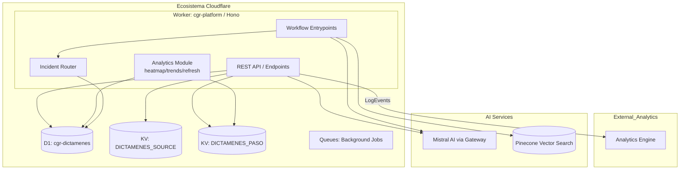
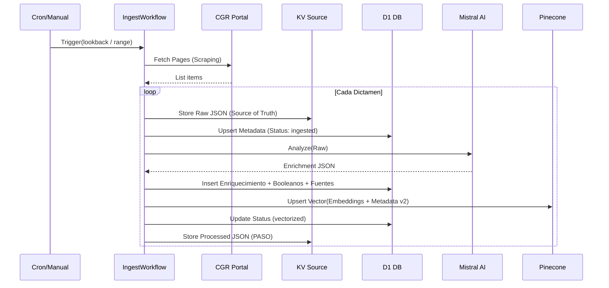
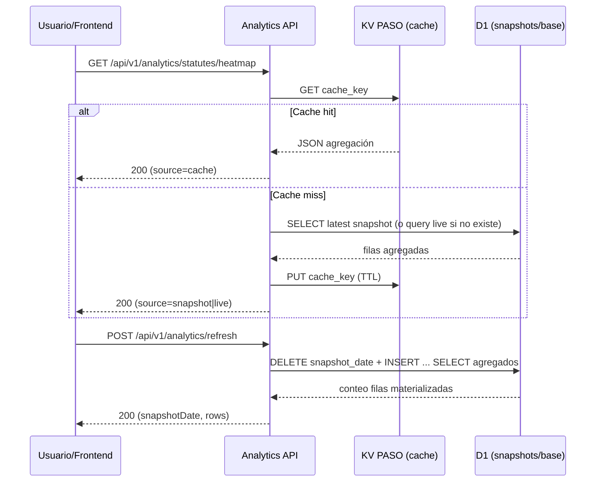
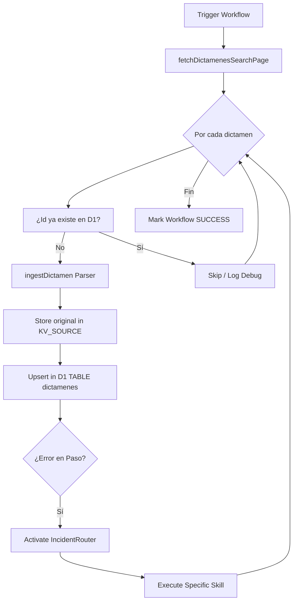

# 02 - Arquitectura C4: CGR-Platform (Profundidad Técnica)

Este documento detalla la estructura técnica de **CGR-Platform** utilizando el modelo C4 para representar desde la interacción sistémica hasta la lógica de implementación a nivel de código.

---

## Nivel 2: Diagrama de Contenedores (Internals)
Detalle de cómo interactúan los servicios vinculados al Worker.

---

## Nivel 3: Diagrama de Componentes (Workflows & Lifecycle)
El corazón de la plataforma reside en sus procesos de larga duración gestionados por Workflows.

---

## Nivel 3.2: Flujo Analítico Fase 1 (Snapshots + Cache KV)
El módulo analítico combina pre-cálculo en D1 y cache temporal en KV para evitar cargas pesadas por consulta.

---

## Nivel 3.1: Ingeniería Inversa y Scraping de CGR
El sistema interactúa con el portal oficial de la Contraloría General de la República mediante una API "oculta" de Elasticsearch.

### Arquitectura de Extracción
1. **Inicialización**: Se consulta `/web/cgr/buscador` para inicializar una sesión y obtener cookies válidas.
2. **Consulta a Elasticsearch**: Se utiliza el endpoint `/apibusca/search/dictamenes` vía `POST`.
3. **Filtros Dinámicos**: El sistema utiliza el array `options` para segmentar por:
   - `fecha_documento`: Rangos ISO 8601 con operadores `gt`/`lt`.
   - `n_dictamen`: Recuperación por número exacto.
   - `year_doc_id`: Filtrado por año de emisión.
4. **Sintaxis Lucene**: Se aprovecha el parámetro `search` para inyectar prefijos técnicos como `abogado:`, `origen:` e `id:`.

---

## Nivel 4: Diagrama de Código (Lógica de Workflows)
Detalle del motor de ejecución y los componentes críticos.

### 4.1. Pinecone Integrated Inference
A diferencia de arquitecturas tradicionales, **CGR-Platform** utiliza la inferencia integrada de Pinecone (Serverless).
- **Modelo de Embeddings**: Manejado internamente por Pinecone (integrated).
- **Flujo de Vectorización**: El worker envía el texto crudo y la metadata v2; Pinecone genera el vector y persiste el registro en un único paso atómico.

### 4.2. Ciclo de Vida del IngestWorkflow
El workflow principal (`src/workflows/ingestWorkflow.ts`) orquesta múltiples servicios externos.

### 4.2. Clases Críticas de Infraestructura
Un agente LLM debe entender estas abstracciones para manipular datos:

- **D1 Client (`src/storage/d1.ts`)**:
  - `upsertDictamen()`: Maneja la lógica de creación/actualización y previene duplicados.
  - `insertEnrichment()`: Persiste la metadata generada por Mistral.
  - `updateDictamenStatus()`: Controla la máquina de estados (`ingested` -> `enriched` -> `vectorized`).

- **AI Client (`src/clients/mistral.ts`)**:
  - `analyzeDictamen()`: Encapsula el prompt legal y la lógica de validación de JSON retornado por el LLM.

- **Incident Manager (`src/lib/incident.ts`)**:
  - Estructura `Incident`: Contiene `stack`, `context`, `severity` y `metadata`.
  - `IncidentRouter`: Mapea el mensaje de error contra un `SkillName`.

---

## 🔍 Reglas de Oro de "El Librero" para la Arquitectura
1. **La Red es Hostil**: Todo llamado externo (`fetch`) debe estar dentro de un bloque try/catch que genere un incidente normalizado.
2. **Lo que no se mide no existe**: Cada cambio de estado debe quedar registrado en `D1` con su respectivo `updated_at`.
3. **Inmutabilidad del Origen**: La data en `KV_SOURCE` es sagrada. No se modifica, solo se re-lee para generar nuevos estados en `KV_PASO`.
