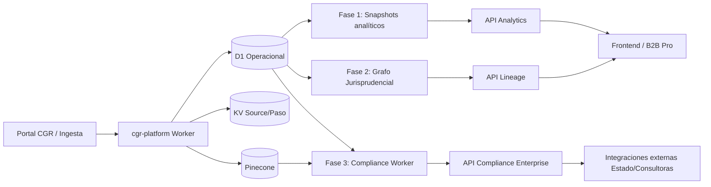

# 08 - Roadmap Estratégico y Operativo (2026-2027)

> [!IMPORTANT]
> **Tipo Diátaxis**: Explicación + Referencia de planificación.
> **Fecha de corte de este documento**: 2026-02-27.
> **Alcance**: Define evolución técnica y de negocio para `cgr-platform` sobre Cloudflare Workers; no reemplaza la referencia de API vigente en `03_referencia_api.md`.

---

## 1. Propósito del Roadmap

Este roadmap convierte la plataforma desde un buscador jurídico inteligente hacia un producto de inteligencia regulatoria explotable en tres líneas comerciales:

1. Analítica normativa (mapas de conflictividad).
2. Trazabilidad jurisprudencial (linaje de dictámenes).
3. Validación preventiva (compliance pre-firma).

El objetivo no es agregar features aisladas, sino aumentar valor económico del activo documental ya construido en D1 + KV + Pinecone, conservando gobernanza determinista y auditabilidad.

---

## 2. Línea Base Técnica (Estado a 2026-02-27)

### 2.1 Capacidades confirmadas en runtime (`cgr-platform/src/index.ts`)

- `GET /api/v1/dictamenes`: búsqueda híbrida (Pinecone con fallback SQL en D1).
- `GET /api/v1/dictamenes/:id`: detalle de dictamen + enriquecimiento + raw referenciado en KV.
- `GET /api/v1/stats`: métricas básicas de volumen y distribución por año.
- `POST /api/v1/dictamenes/crawl/range`: ingesta por rango de fechas (Workflows).
- `POST /api/v1/dictamenes/batch-enrich`: enriquecimiento masivo (Workflows).
- `POST /api/v1/dictamenes/:id/sync-vector`: resincronización vectorial puntual.
- `POST /api/v1/dictamenes/:id/re-process`: reproceso integral de un dictamen.

### 2.2 Activos de plataforma ya disponibles

- Orquestación de larga duración con Cloudflare Workflows.
- Persistencia híbrida:
  - KV para capa cruda/inmutable.
  - D1 para consulta operacional y estados.
  - Pinecone para búsqueda semántica.
- Capa de enriquecimiento legal vía LLM (Mistral) con persistencia estructurada.
- Observabilidad base por logging en Worker.

> [!WARNING]
> Cualquier endpoint nuevo mencionado en este roadmap es **propuesto** hasta que se implemente y se publique en `03_referencia_api.md`.

---

## 3. Principios de Ejecución (No Negociables)

1. **Source of Truth de código**: ningún roadmap invalida lo que ejecuta el código actual.
2. **Compatibilidad de esquema**: cambios de metadata deben ser retrocompatibles o acompañados por workflow de backfill.
3. **Cloudflare-first**: mantener `wrangler.jsonc`, tipado TypeScript, `compatibility_flags: ["nodejs_compat"]` y observabilidad habilitada.
4. **Observabilidad de producto**: cada fase debe definir eventos, métricas y alertas desde el inicio.
5. **Seguridad por defecto**: control de acceso, validación de payloads, rate limiting y separación explícita entre endpoints públicos y administrativos.

---

## 4. Roadmap 2026-2027 por Fases

### Fase 1 (Q2 2026): Analítica Normativa Operacional

### Objetivo
Exponer insights agregados sobre fuentes legales y materias para pasar de “buscar documentos” a “medir tendencias regulatorias”.

### Entregables técnicos
1. Nuevas tablas/vistas agregadas en D1 (ej. snapshots diarios/semanales).
2. Endpoints analíticos de solo lectura (propuestos):
   - `GET /api/v1/analytics/statutes/heatmap`
   - `GET /api/v1/analytics/topics/trends`
3. Cache de lecturas frecuentes en KV para evitar presión de lectura sobre D1.
4. Instrumentación de uso con Analytics Engine (eventos de consulta analítica).

### Riesgos y mitigación
- Riesgo: sobrecarga de D1 por agregaciones pesadas.
- Mitigación: precomputación con Cron + Workflows + snapshots materializados.

### KPI de salida de fase
- p95 endpoint analítico < 800ms.
- Cobertura de snapshots > 95% días del período.
- Errores 5xx en endpoints analíticos < 1%.

---

### Fase 2 (Q3-Q4 2026): Grafo Jurisprudencial Navegable

### Objetivo
Entregar linaje doctrinal utilizable: qué dictamen modifica, reconsidera, complementa o aclara a otro.

### Entregables técnicos
1. Modelo de aristas jurisprudenciales con validación de integridad en D1.
2. Endpoint de linaje (propuesto):
   - `GET /api/v1/dictamenes/:id/lineage`
3. Endpoint de expansión de vecindario (propuesto):
   - `GET /api/v1/graph/dictamenes/:id?depth=2`
4. Reglas de gobernanza de calidad para extracción de referencias (detectar falsos positivos, “IDs huérfanos”, relaciones circulares inválidas).

### Riesgos y mitigación
- Riesgo: alucinaciones o mala extracción de IDs por LLM.
- Mitigación: parser determinista + validación cruzada con expresiones regulares + cola de revisión de anomalías.

### KPI de salida de fase
- `% dictámenes con al menos una arista válida`.
- `precision@k` del extractor de referencias en muestra validada.
- CTR de uso del módulo de linaje en frontend.

---

### Fase 3 (Q1-Q2 2027): API de Compliance Predictivo

### Objetivo
Ofrecer evaluación preventiva sobre borradores normativos/documentales con trazabilidad jurídica explicable.

### Entregables técnicos
1. Servicio dedicado (micro-worker) para cargas de inferencia separadas del worker transaccional.
2. Endpoint enterprise (propuesto):
   - `POST /api/v1/compliance/audit`
3. Pipeline asincrónico con Queues para documentos largos.
4. Respuesta con:
   - score de consistencia,
   - dictámenes similares relevantes,
   - lista de riesgos con fundamento textual.

### Riesgos y mitigación
- Riesgo: costos de inferencia y latencia no predecible.
- Mitigación: límites por plan, colas por prioridad, cache semántico y políticas estrictas de tamaño de documento.

### KPI de salida de fase
- p95 end-to-end audit < 5s (sin cola) y SLA definido para modo asincrónico.
- costo promedio por auditoría dentro del margen objetivo del plan comercial.
- tasa de reintento por timeout < 2%.

---

## 5. Arquitectura de Evolución



---

## 6. Monetización por Producto

| Nivel | Propuesta de valor | Capacidades core | Modelo comercial |
| :--- | :--- | :--- | :--- |
| Search Free | Búsqueda base y detalle de dictamen | Endpoints actuales `/api/v1/dictamenes*` | Freemium |
| Analytics Pro | Tendencias y mapas normativos | Fase 1 + snapshots + métricas | Suscripción mensual |
| Lineage Pro | Trazabilidad doctrinal navegable | Fase 2 + grafo de relaciones | Suscripción mensual |
| Compliance Enterprise | Validación preventiva vía API | Fase 3 + SLA + gobernanza avanzada | Pago por uso + contrato |

---

## 7. Dependencias Técnicas y de Gobernanza

1. **Documentación viva obligatoria**:
   - Nuevos endpoints -> actualizar `03_referencia_api.md`.
   - Cambios de flujo -> actualizar `02_arquitectura_c4.md`.
   - Nuevos escenarios operativos -> actualizar `05_casos_de_uso.md`.
2. **Gestión de migraciones D1** con versionado explícito en `migrations/`.
3. **Política de rollout** por feature flags o rutas versionadas para cambios de alto impacto.
4. **Trazabilidad de incidentes**: integrar eventos de error funcional con skill/routing de mitigación.

---

## 8. Relación con Skillgen (Similitud Semántica)

Este roadmap es semánticamente cercano a `skillgen/README.md` porque ambos describen evolución controlada y gobernanza del sistema. No son equivalentes:

- `08_roadmap.md` define dirección de producto/plataforma (qué construir y por qué).
- `skillgen/*` define ejecución determinista ante incidentes y reglas operativas (cómo reaccionar y mantener estabilidad).

La convergencia práctica ocurre cuando cada fase nueva incorpora:
1. Reglas de detección de anomalías.
2. Playbooks de recuperación.
3. Telemetría para evaluar salud y costo del cambio.

---

## 9. Bonus Track: Manual Git Básico para Gestión de Mejoras

> [!TIP]
> Guía pensada para usuarios no técnicos que necesitan proponer recomendaciones, mejoras o nuevas funcionalidades sin romper la rama principal.

### 9.1 Flujo mínimo recomendado

1. Actualizar rama principal local:
```bash
git checkout main
git pull origin main
```

2. Crear rama para una mejora específica:
```bash
git checkout -b mejora/nombre-corto
```

3. Editar archivos y revisar cambios:
```bash
git status
git diff
```

4. Agregar solo los archivos correctos:
```bash
git add docs/v2/platform/08_roadmap.md
```

5. Crear commit descriptivo:
```bash
git commit -m "docs(roadmap): define fases 2026-2027 con KPIs y gobernanza"
```

6. Subir la rama a GitHub:
```bash
git push -u origin mejora/nombre-corto
```

7. Abrir Pull Request en GitHub para revisión antes de mezclar a `main`.

### 9.2 Convenciones simples que evitan problemas

- Un cambio grande = varias ramas chicas por tema.
- Un commit = una intención clara.
- Nunca trabajar directo en `main` para cambios de contenido.
- Antes de pedir revisión, ejecutar:
```bash
git status
```
(si no dice “working tree clean”, todavía faltan pasos).

### 9.3 Cómo registrar recomendaciones sin tocar código

Si solo se quiere proponer una idea:
1. Crear archivo en `docs/` con prefijo `propuesta_`.
2. Explicar problema, impacto, propuesta y riesgos.
3. Subir en una rama dedicada y abrir PR para discusión.

Este método deja historial auditable y evita pérdida de contexto en chats o mensajes sueltos.

---

**Estado del roadmap**: Vigente (2026-02-27), sujeto a revisión trimestral.
