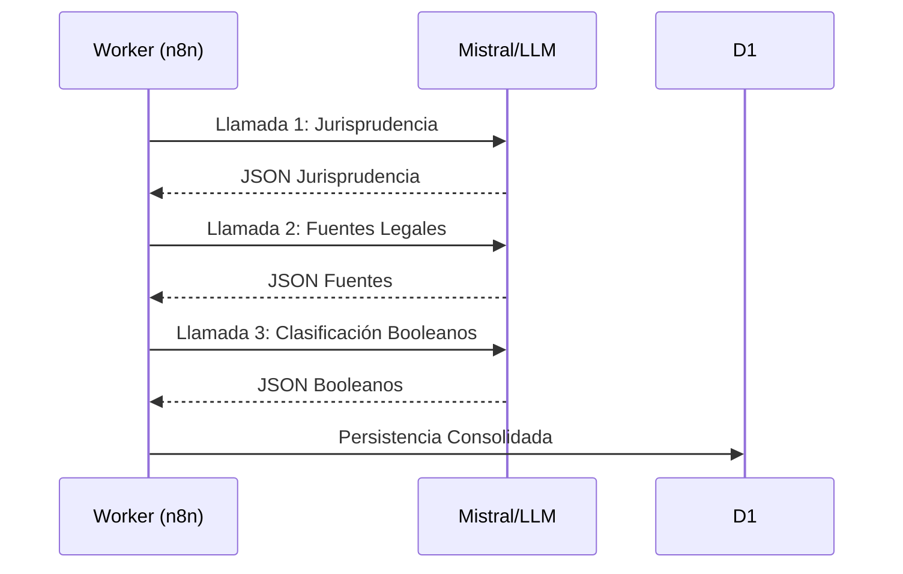

# 09 - Análisis de Enriquecimiento: Desfase n8n vs. Worker

Este documento detalla la investigación técnica sobre la discrepancia en el proceso de enriquecimiento de dictámenes entre el flujo histórico de n8n y la implementación actual en el `cgr-platform`.

---

## 📖 1. El Hallazgo
Durante la auditoría de datos del sistema de enriquecimiento, se detectó que los campos `booleanos_json` y `fuentes_legales_json` en la tabla `enriquecimiento` (D1) estaban vacíos o contenían datos parciales, a pesar de estar presentes en el flujo original de n8n.

### Auditoría del Código (`src/clients/mistral.ts`)
Se confirmó que la función `analyzeDictamen` posee un prompt incompleto en comparación con los nodos originales de n8n:
- **Jurisprudencia**: Implementado correctamente (Título, Resumen, Análisis).
- **Booleanos (Atributos Jurídicos)**: Omitidos en el prompt de Mistral, aunque el código intenta normalizarlos tras la llamada.
- **Fuentes Legales**: Existe una función `analyzeFuentesLegales` pero no está integrada en el flujo principal de `backfillWorkflow.ts`.

---

## 🏗 2. Arquitectura de Flujos

### Flujo Original (n8n)
El flujo original utilizaba un enfoque **secuencial** con tres llamadas distintas a modelos de IA:
1. **ExtraeJurisprudencia**: Título, resumen, análisis.
2. **Extrae Fuentes Legales**: Parsing de referencias legales.
3. **Interpreta Boolean**: Clasificación de 12 atributos afirmativos/negativos.



### Arquitectura Propuesta: Consolidación vs. Secuencial
Para optimizar latencia y costos en Cloudflare Workers, se propone evaluar dos estrategias mediante un **Benchmark**:

1. **Estrategia Consolidada**: Un único "Mega-Prompt" que instruya a `mistral-large-2512` a realizar las tres tareas en una sola respuesta.
2. **Estrategia Secuencial**: Mantener la lógica de n8n pero optimizada dentro del mismo Worker.

---

## 🔬 3. Benchmarking Comparativo

A petición del usuario, se realizaron dos fases de pruebas críticas para validar la capacidad del modelo frente a estas dos arquitecturas usando el dictamen `000007N21`. Adicionalmente, se detectó un problema de "pereza" en el modelo (uso de elipsis como `[omitiendo por brevedad]`) que obligó a una iteración estricta del prompt.

### Resultados del Benchmark Final: V1 vs V5 Semantic Depth
| Métrica | Original (V1) | Semantic Depth (V5) |
| :--- | :--- | :--- |
| **Latencia Total** | 20.7s | **20.8s** |
| **Costo (Tokens)** | 8,025 tokens | **8,600 tokens** |
| **Calidad Jurídica** | Truncada | **Superior (Narrativa Integrada)** |

> [!TIP]
> El enfoque **Consolidado V5 Semantic Depth** no solo resuelve el truncamiento, sino que elimina la "majadería" de los listados vacíos de dictámenes. Al obligar al modelo a integrar cada cita en la narrativa, se enriquece el vector de búsqueda en **Pinecone**, permitiendo recuperaciones mucho más precisas basadas en relaciones jurídicas complejas.

---

## 📝 4. Registro de Prompts

Siguiendo el estándar de **"El Librero"**, se documentan a continuación los prompts exactos utilizados. 

> [!NOTE]
> Esta documentación se rige por la [Guía de Estándares para Agentes LLM: El Librero](file:///home/fermaf/github/cgr/docs/v2/platform/00_guia_estandares_agentes_llm.md).

### A. Prompts Originales (n8n)
*Véase histórico de n8n para detalles de `ExtraeJurisprudencia`, `Interpreta Boolean` y `Extrae Fuentes Legales`.*

---

### B. Prompt Consolidado (Versión Final V5 Semantic Depth)

Este prompt es el resultado de la optimización final para maximizar la calidad del sistema RAG. Fuerza al modelo `mistral-large-2512` a integrar citas de forma narrativa, garantizando profundidad semántica para la vectorización en Pinecone y evitando análisis perezosos o truncados.

```text
Eres un abogado, eminencia en derecho administrativo en Chile.

Tu entrada es el dictamen completo (texto íntegro + metadatos + campo 'fuentes_legales' si existe).

### TAREA CRÍTICA (PROFUNDIDAD SEMÁNTICA):
Analiza el dictamen y entrega UNA SOLA respuesta JSON integral. 
PROHIBICIÓN ABSOLUTA de truncamiento (..., [omitiendo], etc.).

### 1. Jurisprudencia
- titulo: descripción efectiva del dictamen, máximo 66 caracteres.
- resumen: narración jurisprudencial brillante, máximo 246 caracteres.
- analisis: narrativa jurisprudencial de ALTA PROFUNDIDAD SEMÁNTICA. 
  * Explica contexto, hechos, razonamiento y fundamentación jurídica completa. 
  * INTEGRACIÓN DE CITAS: No hagas listas de dictámenes. Cada vez que menciones jurisprudencia previa (ej. dictamen X), integra la cita en la narrativa explicando brevemente su relevancia o relación con el caso actual. 
  * El objetivo es que el texto sea rico para búsquedas vectoriales (Pinecone) pero fluido para un experto.
  * Mínimo 1500 caracteres, máximo 999 tokens. DEBE SER TEXTO CONTINUO.
- etiquetas: array de 3 a 6 etiquetas.
- genera_jurisprudencia: boolean true si genera doctrina administrativa.

### 2. Booleanos
Clasifica según dictamen (SI/1 -> true; NO/vacío -> false).

### 3. Fuentes Legales
Extrae referencias explícitas del texto. 
- nombre (sigla), numero, year (4 dígitos), sector, articulo, extra (o null).

### Políticas de Estilo:
- Impersonalidad total ("Se establece", "Se concluye").
- NUNCA "de Chile" ni "chilenas".
- Anonimización estricta de personas naturales.

### Formato de Salida (JSON ÚNICAMENTE):
{
  "extrae_jurisprudencia": {
    "titulo": "",
    "resumen": "",
    "analisis": "",
    "etiquetas": []
  },
  "genera_jurisprudencia": false,
  "booleanos": { ... },
  "fuentes_legales": [ ... ]
}
```

## ⚙️ 5. Ciclo de Operación e Instrucciones

El proceso de enriquecimiento puede ejecutarse de dos formas: de manera automática mediante un ciclo de fondo o de manera manual para procesamiento por lotes o re-enriquecimiento.

### A. Ciclo Programado (Automático)
Este proceso es gestionado por un **Cloudflare Worker Cron Trigger** que se ejecuta periódicamente (actualmente configurado cada 30 minutos).

1.  **Detección**: El worker consulta la tabla `dictamenes` en D1 buscando registros que no tengan una entrada correspondiente en la tabla `enriquecimiento`.
2.  **Enriquecimiento**: Por cada dictamen pendiente, se llama a la función `analyzeDictamen` en `src/clients/mistral.ts` usando el modelo `mistral-large-2512` y el **Prompt Consolidado V5**.
3.  **Persistencia**: El JSON resultante se valida, se normalizan los booleanos y se inserta en D1 junto con los metadatos de calidad del LLM (tokens, modelo, versión del prompt).

### B. Uso Manual (CLI / Scripts)
Para procesos de mantenimiento, auditoría o re-enriquecimiento masivo (backfill), se utiliza el script de enriquecimiento desde la raíz del proyecto.

#### Comando de Enriquecimiento:
```bash
# Enriquecer un dictamen específico por ID
npx tsx scripts/enrich-dictamen.ts --id 000007N21

# Ejecutar proceso de backfill masivo
npx tsx scripts/backfill-enrichment.ts --limit 100
```

#### Monitoreo y Auditoría:
Para validar que el enriquecimiento se realizó con el prompt correcto y sin truncamientos, se puede consultar D1:
```sql
SELECT id, model_version, prompt_version, LENGTH(analisis) as len 
FROM enriquecimiento 
WHERE id = '000007N21';
```

> [!NOTE]
> Cualquier cambio en el prompt consolidado requiere actualizar el campo `prompt_version` en la lógica de persistencia para mantener la trazabilidad de qué versión generó cada análisis.

---

> [!IMPORTANT]
> Esta documentación ha sido generada siguiendo las políticas de [El Librero](file:///home/fermaf/github/cgr/docs/v2/platform/00_guia_estandares_agentes_llm.md) para garantizar la trazabilidad y la excelencia técnica en el proyecto CGR-Platform.

