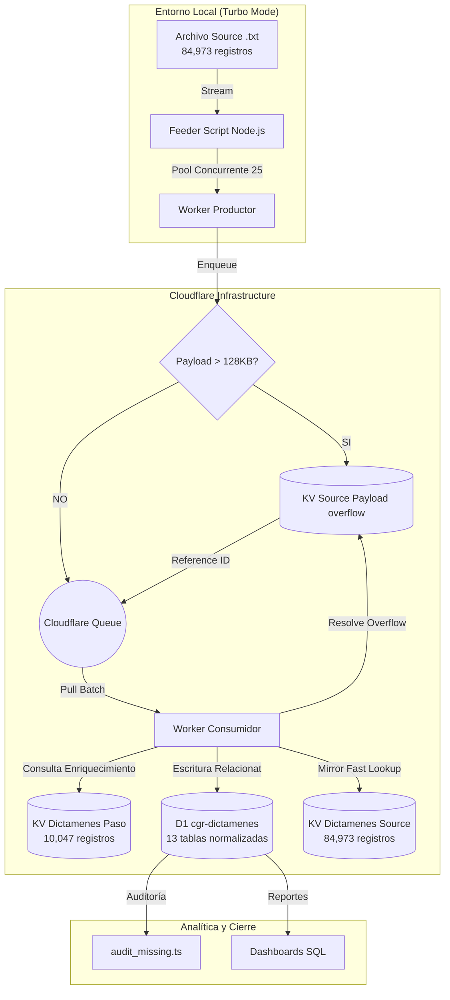

# Documento de Arquitectura - Migración 3 (Final)

## 1. Resumen Ejecutivo
Sistema de ingesta masiva de 84,973 dictámenes (1.2GB) hacia Cloudflare usando arquitectura orientada a eventos con **Cloudflare Queues**. Los datos se almacenan en un modelo relacional normalizado (**13 tablas**) en **Cloudflare D1** para análisis SQL avanzado, mientras **Cloudflare KV** actúa como capa de lectura rápida y buffer para payloads grandes.

## 2. Diagrama de Arquitectura

## 3. Componentes del Sistema

### 3.1 Turbo Local Feeder
**Ubicación**: `scripts/feeder.ts`
- **Capacidad**: Procesa el backup de 1.2GB usando Node.js Streams.
- **Turbo Paralelismo**: Implementa un pool de promesas (concurrencia=25) para saturar el ingreso a la nube, reduciendo tiempos de horas a minutos.
- **Resiliencia**: Captura errores de JSON a nivel de registro sin detener el flujo.

### 3.2 Cloudflare Worker (Doble Capa)
**Ubicación**: `src/index.ts`

#### Gestión de "Payload Too Large"
Para registros que exceden el límite de 128KB de las colas:
1. El productor desvía el `raw_data` a un KV temporal.
2. El consumidor detecta el flag `large_ref`, recupera el dato de KV y limpia el temporal.

#### Mapping Relacional (13 Tablas)
El worker transforma el JSON plano en una estructura SQL:
- **Integración AI**: Los registros con análisis previo en `DICTAMENES_PASO` se catalogan con sus campos de enriquecimiento (títulos, resúmenes) en D1.
- **Normalización**: Abogados a UPPER, Descriptores a LOWER, Campos generales a TRIM.
- **Idempotencia**: Se limpian tablas hijas antes de re-insertar mediante transacciones `batch()`.
- **Change Log**: Tabla `historial_cambios` registra diferencias campo a campo si el registro ya existía.

### 3.3 Esquema Relacional de Datos (D1)
- **Catálogos**: `cat_divisiones`, `cat_abogados`, `cat_descriptores`.
- **Hechos**: `dictamenes` (con flag `es_enriquecido`), `atributos_juridicos`, `enriquecimiento`.
- **Auditoría**: `auditoria_migracion`, `historial_cambios`.
- **Relaciones N:M**: `dictamen_abogados`, `dictamen_descriptores`.
- **Detalle PASO**: `dictamen_fuentes_legales`, `dictamen_referencias`, `dictamen_etiquetas_llm`.

### 3.4 Cloudflare KV: Capa de Acceso Rápido y Buffer
- **DICTAMENES_SOURCE**: `ac84374936a84e578928929243687a0b` (Mirror & Overflow).
- **DICTAMENES_PASO**: `4673b680cd704508a4fbc87789acb153` (Fuente de Enriquecimiento AI).

## 4. Auditoría y Verificación
El script `scripts/audit_missing.ts` permite reconciliar la fuente original con los IDs insertados en D1 mediante un volcado JSON (`scripts/logs/d1_ids.json`), garantizando integridad del 100% de los datos.

---
*Arquitectura v3.1 - Sincronización Final AI/Relacional*
